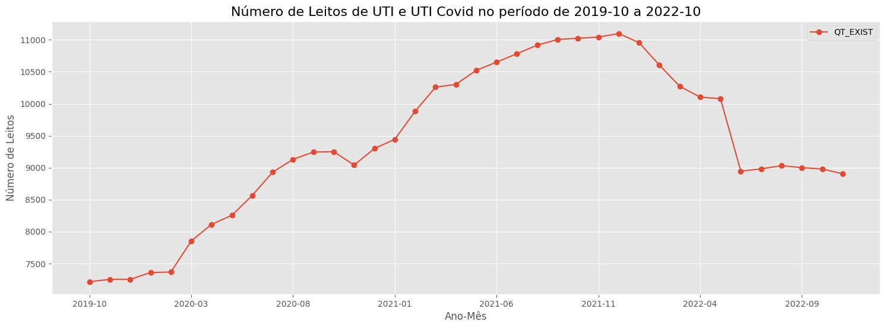
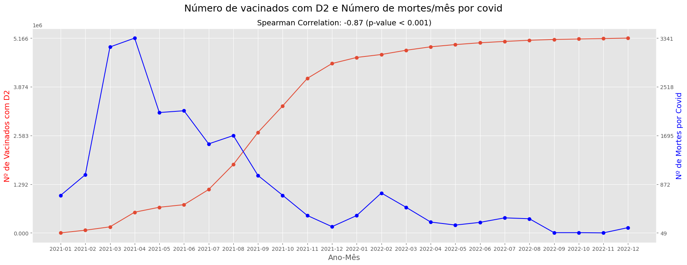

# Análise de Leitos do Estado de Goiás durante o período de 10/2019 a 11/2022

## 1. Dados utilizados

Para realização desse projeto foram utilizadas diversas fontes de dados: os dados foram obtidos através da plataforma DATASUS, da Secretária de Estado de Saúde de Goiás, além de projetos open-source disponíveis no github.

Você pode encontrar todos os dados [aqui](https://drive.google.com/drive/folders/1NsvAb6p2wMMb5ZoLGxkjbLn-BP0twPSg?usp=sharing)

## 2. Analises da evolução do número de leitos no tempo e da capacidade hospitalar

### 2.1 Observando o número total de leitos do Estado de Goiás

- Na imagem acima podemos ver que antes do período pandêmico já havia uma tendência baixa de crescimento no número de leitos

- Além disso, percebe-se que realmente a capacidadade de leitos passou a aumentar de modo mais acelerado com o início da pandêmia por volta de Março de 2020, até um pico que se encontra em Dezembro de 2021.

- A partir de Dezembro de 2021 inicia-se o processo da redução da capacidade hospitalar disponível.

### 2.2 Observando o total de leitos pelo tipo de leito

- Nos dados de Leitos retirados do DATASUS há a indicação de que existem 7 tipos de leitos diferentes.

- Observando atentamente percebe-se que apenas 2 tipos de leito (2 e 3) apresentaram aumento significativo durante o período de pandemia, e acompanha a tendência de capacidade hospitalar total (Imagem 1).

- Não encontrei um dicionário de dados que especificasse o significado das numerações dos tipos de leito, por inferência assumi que os leitos 2 e 3 estão relacionado a UTI e UTI Covid.

#### 2.2.1 Leitos UTI e UTI Covid

- A imagem acima apresenta o total de leitos 2 e 3 somados, percebe-se que eles seguem a mesma tendência da curva de leitos totais, sendo assim para algumas análises será interessante utilizar apenas esses leitos

### 2.3 Observando o total de Leitos SUS e Não SUS

- A imagem acima apresenta a análise dos leitos totais, separando por leitos SUS e não SUS.

- De modo geral, ao longo de toda série os Leitos SUS representam cerca de 70% do total e os leitos não SUS 30%

- Ao longo da série temporal os dois tipos de leito crescem de forma semelhante, isso pode demonstrar que não haveria leitos SUS suficiente para atender toda a demanda durante o período pandemico, sendo necessária a contratação de leitos não SUS.

- Quando olhamos apenas os tipos UTI e UTI covid percebemos um crescimento mais acelerado em relação ao todo, seguindo a mesma linha da análise geral, a proporção se mantém 70% SUS e 30% não SUS.

## 2.4 Analisando a capacidade hospitalar durante o período

### 2.4.1 Número total de leitos VS Ocupação de leitos covid

- Conforme apontado anteriormente, percebemos um crescimento acelarado no período pandêmico, com início em Março de 2020 e fim em Dezembro de 2021. Em seguida inicia-se o período de redução da capacidade hospitalar

- Para tentar entender o porque desse comportamento, primeiramente realizei a comparação de tendência entre a série temporal de leitos totais e número de leitos covid ocupados.

- Visualmente percebemos que a medida que um cresce o outro cresce também, até Julho de 2021 onde há o inicio do processo de queda da ocupação de leitos, levando em seguida a uma queda na capacidade hospitalar, possivelmente devido a redução da demanda de internações.

- Por meio da correlação de Spearman foi encontrado um Rhô de 0.41, demonstrando uma correlação moderada com p-valor significativo.

### 2.4.2 Leitos totais VS Número de vacinados com pelo menos 2ª Dose

- Durante o período de espera da chegada das vacinas pode-se perceber um aumento na capacidade hospitalar, porém com o passar do tempo as pessoas foram sendo imunizadas contra a covid, levando a redução de sintomas mais severos, com isso redução das ocupações e consequentemente redução da capacidade hospitalar.

- Percebe-se um crescimento exponencial de vacinados com pelo menos 2ª Dose durante o período de Julho de 2021 a Dezembro de 2021, esse crescimento é seguido da queda da capacidade hospitalar.

- Sendo assim, é possível que o aumento da imunização da população de Goiás levou a uma redução na demanda hospitalar e consequentemente do número de leitos.

- Por meio do Rhô de Spearman verificamos uma correlação moderada para forte entre o número de leitos e o número de imunizados, apresentando um Rhô de 0.63 com p-valor altamente significativo.

### 2.4.3 Leitos Totais VS Número de mortes por Covid

- Vemos que há uma certa semelhança entre as tendências de crescimento e decaimento das curvas.

- Inicialmente a letalidade da doença era maior devido a falta de imunizantes adequados para a população, isso levou a uma maior ocupação dos leitos e sintomas mais graves, o que levou a necessidade de aumento da capacidade hospitalar e mais óbitos.

- Apesar de não ser significativo (p-valor > 0.05), ainda existe uma correlação entre as duas séries temporais de 0.22.

### 2.4.4 Vacinados 2ª Dose Vs Ocupação

- Conforme apontado anteriormente, era esperado que com o aumento da imunização a ocupação de leitos fosse reduzida. 

- A redução da gravidade dos sintomas causada pela imunização adequada levou a uma redução na ocupação ao longo do tempo, e com isso a necessidade de redução da capacidade hospitalar.

- Verificou-se uma correlação negativa forte altamente significativa (Rhô = -0.9, p-valor < 0.001), demonstrando o impacto real dos imunizantes nas ocupações de leitos.

### 2.4.5 Vacinados 2ª Dose vs Mortes por covid

- Nessa análise pode ser usada a mesma lógica do item anterior, quanto maior a imunização menor o número de mortes, já que os sintomas são mais leves e com isso menor ocupação e redução da demanda de leitos.

- O início da redução da capacidade bate com um dos pontos de mínimo no número de mortes, em Dezembro de 2021.

- Há uma correlação negativa forte altamente significativa entre as duas séries temporais.

### 2.4.6 Leitos UTI Vs Ocupação

- Conforme discorrido anteriormente, a redução da ocupação impactou diretamente a redução da capacidade hospitalar.

- Quando olhamos apenas para os leitos UTI essa afirmação fica mais clara ainda, apresentando uma correlação forte de 0.66 altamente significativa.

## 3. Análise geográfica e temporal

### 3.1 Observando Leitos por 1000 habitantes

Para ver essa figura interativa acesse o final do notebook .

- Percebemos que existem cidades que se saem melhor na questão de leitos por 1000 habitantes, isso pode se dar devido a uma boa gestão das prefeituras locais ou ainda por baixa contaminação naquelas cidades.

- De acordo com a OMS a recomendação é que hajam de 3 a 5 leitos por mil habitantes, durante o período analisado Goiás teve em média:
  - 103.89 Municípios abaixo da recomendação
  - 55.02 Municípios dentro da recomendação
  - 30.94 Municípios acima da recomendação

### 3.2 Observando Leitos Vs Ocupação

Para ver essa figura interativa acesse o final do notebook .

- Nesse plot a circunferência indica o número de leitos por 1000 habitantes

- A cor indica o número de contaminações por 100 mil habitantes.

- É um gráfico interessante pois é possível verificarmos como os municípios estão se saindo de modo geral, já que é possível observar 4 variáveis ao mesmo tempo, sendo elas Número de leitos, Ocupação, Leitos por 1000 habitantes e Contaminação por 100 mil habitantes.

